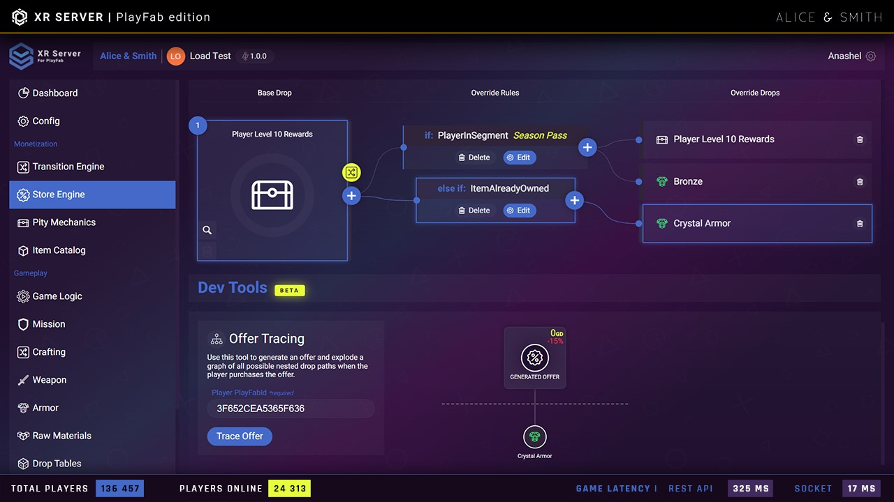
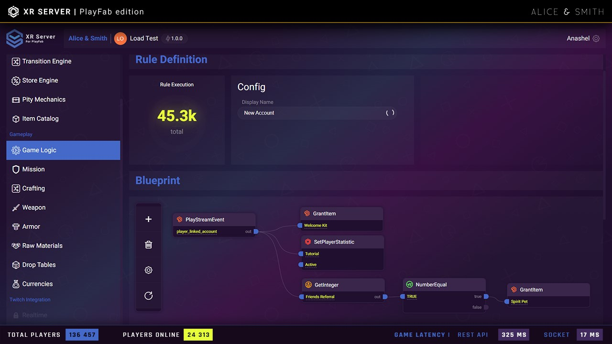
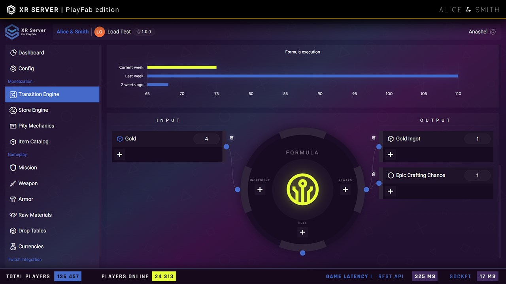
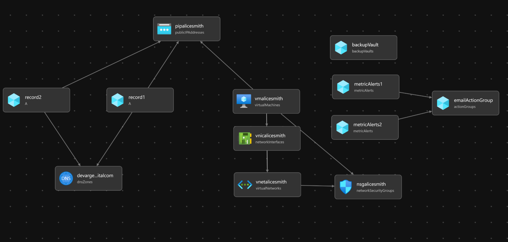

# azure-alicesmith-bicep

## Quickstart: Create an Game XR Server for PlayFab by BICEP

### Overview
Zero-code API server and gamification toolkit for PlayFab with Twitch and Unreal Engine support
XR server for Playfab by Alice and Smith drastically cuts down on the number of resources required to develop and manage your live ops, leaving more time for you to focus on what matters most: your product and your community. --- Quickly integrate Microsoft Playfab, Twitch API, Microsoft Teams, Unreal Engine, and other tools under a compliant on-premise solution. Key features include Full access to all Microsoft PlayFab APIs, Player progression, XP, badges, leaderboard, advanced store engine, segmentation management, crafting, loot table, multiple currencies, loyalty mechanics, mission system, community objective, vote, poll, and more. XRServer is compatible with Azure FrontDoor firewall security, Azure Events Stream, Playstream, and Azure Synapse Analytics. --- Pre-built third-party integration with Twitch, Twitch Extension, Twitch API, Unity, Google AI DialogFlow, Authentication service (AD B2B, AD B2C, MS Teams, JWT, Auth0, Custom ID ...) --- Build various products and solutions for Triple-A Console, PC, and Mobile game with Unreal Engine, Loyalty Program, gamified store, interactive products, Corporate Training, Coaching platform, and many more... --- Advanced Analytics and Security: Play stream ingestion for Microsoft Events Hub, Integration with Azure Data Factory and Azure Synapse Analytics, Websocket Subscription with SignalR, PowerBI, SQL and Datawarehouse support. On-Premise compliance for Azure Front Door, Azure Load Balancer, Backup & Restore, etc. --- To set up your instance, visit: https://azuremarketplace.microsoft.com/en/marketplace/apps/asdivertissementinc1617837708654.playfab_xr

to create a virtual machine on console:
https://portal.azure.com/#create/asdivertissementinc1617837708654.playfab_xrxr-server-v03

Want to deploy programmatically? Get started

### Prerequisites
An Azure subscription. If you don't have an Azure subscription, create a free account before you begin.

### Review the Bicep file

